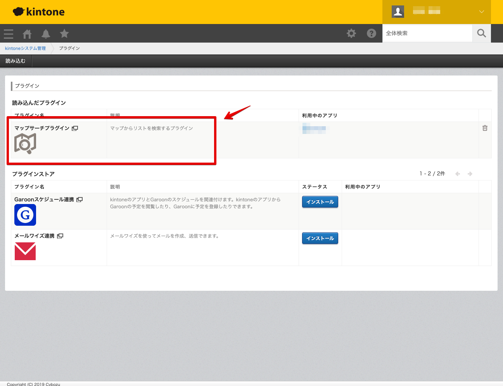
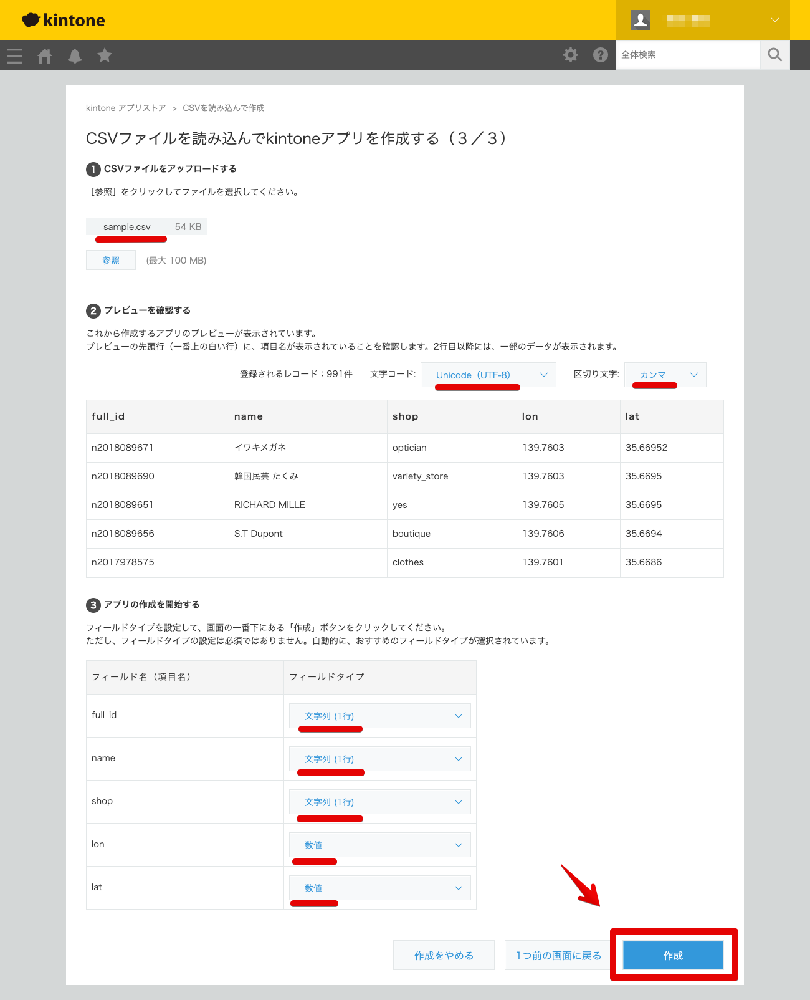
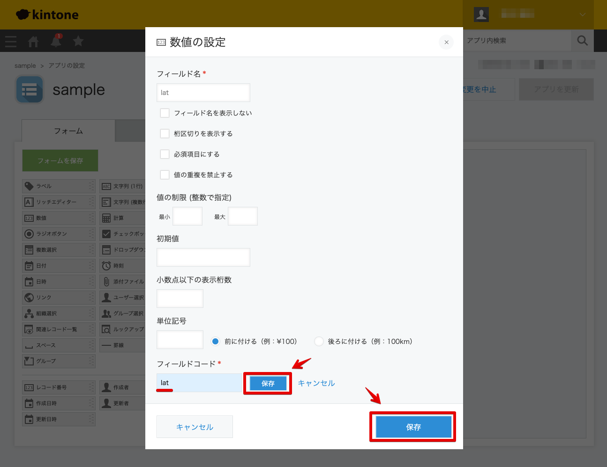
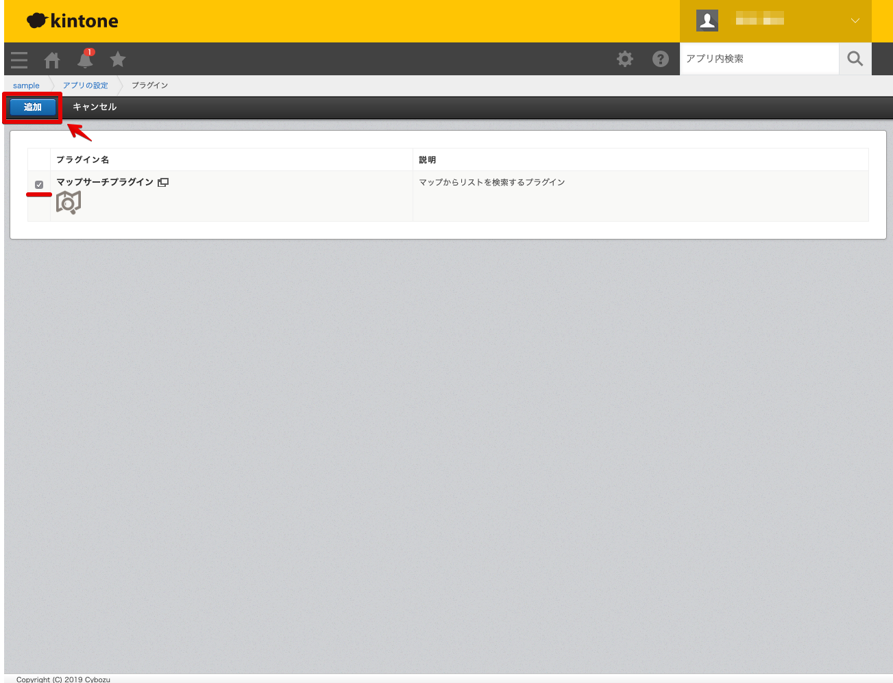

# kintone-mapsearch-plugin  

kintone-mapsearch-pluginは、登録データの地図範囲検索ができるkintoneのプラグインです。  

<br>

## 使用方法  


<br>

kintoneにプラグイン登録  
```
./dist/plugin.zip  
```


<br>

CSVでアプリ新規追加  
必須フィールド: name, lon, lat  
すべてフィールド名 = フィールドコードに置き換え  
```
./data/sample.csv  
```



<br>

アプリにプラグイン適用  


<br>
<br>

## 開発方法

- node v13.1.0  
- npm v6.13.0  

<br>

インストール  
```bash
npm install
```

<br>

デプロイ  
```bash
npm start
```

<br>
<br>

## ライセンス
MIT

Copyright (c) 2019 Yasunori Kirimoto

<br>
